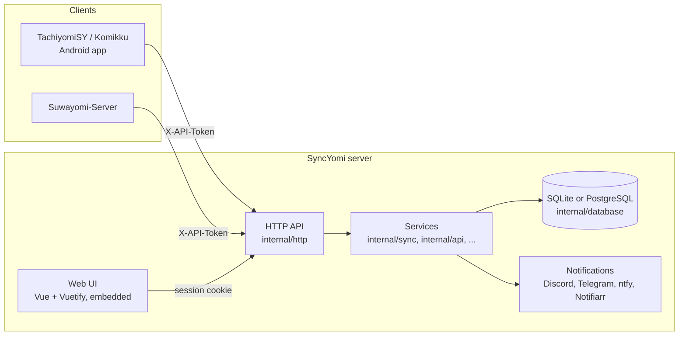

# Architecture

## Components

- **Server** – a single Go binary (`main.go`) that serves the API and the embedded web UI. One process, one database.
- **Web UI** – Vue 3 SPA under `web/`, built with Vite and embedded into the binary via `web/build.go`. It only talks to the session-authenticated endpoints; it never touches sync payloads.
- **Clients** – TachiyomiSY, Komikku and Suwayomi-Server all implement the same client protocol. Suwayomi-Server is a *client* of SyncYomi (it syncs its own library), not an alternative server.
- **API key = user.** Every sync-related row is keyed by the API key; all devices that should share a library use the same key.

## Package map

| Package | Role |
|---|---|
| `internal/http` | chi router, handlers, auth middleware (`IsAuthenticated` for API key or session, `IsSessionAuthenticated` for web-UI-only endpoints) |
| `internal/sync` | sync service: content storage pass-through, device/status bookkeeping, sync-event notifications |
| `internal/api` | API key service with an in-process key cache used on every authenticated request |
| `internal/auth`, `internal/user` | web UI login / onboarding, argon2id password hashing (`pkg/argon2id`) |
| `internal/database` | repositories (raw SQL via squirrel) and schema migrations for both dialects |
| `internal/domain` | interfaces and models shared by the layers |
| `internal/notification` | notification senders |
| `internal/config` | TOML config loading (viper), defaults, hot reload |
| `web/` | the SPA |

## How a sync works (protocol v2)

The server keeps every library as merged items (manga, chapters, categories, settings) in
`sync_item` and merges each upload item by item; clients send what changed and receive what
they lack. See [sync-protocol-v2.md](sync-protocol-v2.md) and [data-model.md](data-model.md).

| Package | Role |
|---|---|
| `internal/backup` | protobuf schema of the Tachiyomi backup (`pb/`), decode/encode, `Split` (backup → items) and `Render` (items → backup) |
| `internal/merge` | the merge rules on a generic item model; no I/O, no payload parsing |
| `internal/sync` | orchestration: legacy import, merge, delta/full responses, render cache, per-key locking |
| `internal/database/syncstore.go` | the item store transaction (`sync_state`, `sync_item`, render cache, device cursors) |

## Protocol v1 (deprecated)

Older clients download the whole library, merge it locally and upload the result. The server
now serves them the backup rendered from the item store and merges their uploads, so v1 and
v2 devices can share a library.

```mermaid
sequenceDiagram
    participant C as Client
    participant S as SyncYomi
    C->>S: GET /api/sync/content (If-None-Match: etag)
    alt unchanged
        S-->>C: 304
    else changed
        S-->>C: 200 payload + ETag
        C->>C: merge remote into local library
    end
    C->>S: PUT /api/sync/content (If-Match: etag)
    alt nobody else wrote in between
        S-->>C: 200 new ETag
        C->>C: restore merged data locally
    else another device wrote first
        S-->>C: 412
        C->>C: retry on next sync
    end
    C->>S: POST /api/sync/event (SYNC_SUCCESS / SYNC_FAILED ...)
    S-->>S: update device + status, send notifications
```

The `ETag` is an opaque token regenerated on every write. `If-Match` on `PUT` is the only concurrency control; without it the payload is replaced unconditionally.

### Data kept per API key

| Table | Content |
|---|---|
| `sync_state`, `sync_item` | the merged library: one row per manga/chapter/category/setting with its version and the `seq` of its last change |
| `sync_data` | the last full backup rendered from the items (served to v1 clients) and its ETag |
| `sync_data_history` | the last *N* payloads (`syncHistoryLimit`) so a bad sync can be rolled back from the web UI |
| `sync_device` | devices seen for the key (from `X-Device-ID`/`X-Device-Name` headers or the `device_id`/`device_name` fields of sync events), last seen time and last reported status |
| `sync_status` | last successful upload, last reported event and message |

### Why the merge moved to the server

With client-side merging each client decided that an item missing on the other side was "deleted elsewhere" by comparing the item's modification time with the client's own last-sync time. With two or more devices that inference is wrong when device B syncs between device A adding an item and device A uploading it: B drops the new item as deleted, and then A does too (jobobby04/TachiyomiSY#1635). Only the server knows when an item first arrived; in v2 nothing is ever deleted by absence.
