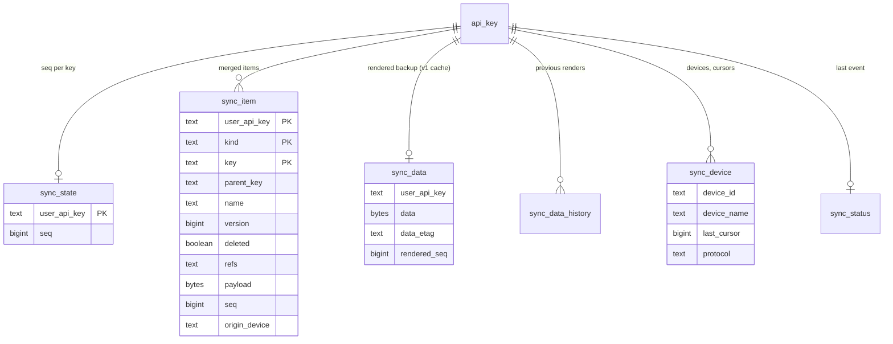

# Data model

## sync_item

One row per merged item. `kind` is one of `manga`, `chapter`, `category`, `source`,
`app_pref`, `source_pref`, `ext_store`, `saved_search`, `extra`.

| Column | Meaning |
|---|---|
| `key` | `source\|url` for manga, `<manga key>\x1f<url>` for chapters, `uid:<uid>` / `name:<name>` for categories, natural keys for settings |
| `parent_key` | manga key for chapters, source key for source preferences |
| `name` | category name (used for the uid-less fallback match) |
| `version` | the client's counter; higher wins |
| `deleted` | category tombstone |
| `refs` | manga → category keys, `\x1f`-separated |
| `payload` | the item's protobuf message (a manga payload carries neither chapters nor category numbers) |
| `seq` | the key's `sync_state.seq` at the last change of this row |
| `origin_device` | device that made the last change (`legacy`, `migration`, `restore` for server-side writes) |

The server never parses the payload beyond what the merge keys need, which is what will let
end-to-end encryption reuse the same store.

## seq and cursors

`sync_state.seq` increases by one for every request that writes something. All rows touched
by that request carry the new `seq`. A client's cursor is the `seq` it last saw; the delta it
receives is `seq > cursor` (plus all categories). `sync_device.last_cursor` records it per
device for the web UI.

## Render cache and history

`sync_data` holds the last full backup rendered from the item store together with the `seq`
it was rendered at (`rendered_seq`). It is refreshed after every write and serves v1 clients
and the v2 snapshot endpoint. Each refresh also lands in `sync_data_history`
(`syncHistoryLimit` entries), which is what *Restore* in the web UI rebuilds the store from.

A `sync_data` row with `rendered_seq = NULL` is a blob written by a pre-v2 server. On the
first request for that key after the upgrade it is decoded and imported into `sync_item`
(device `migration`); if it cannot be decoded the raw blob keeps being served to v1 clients
and the item store starts empty.
