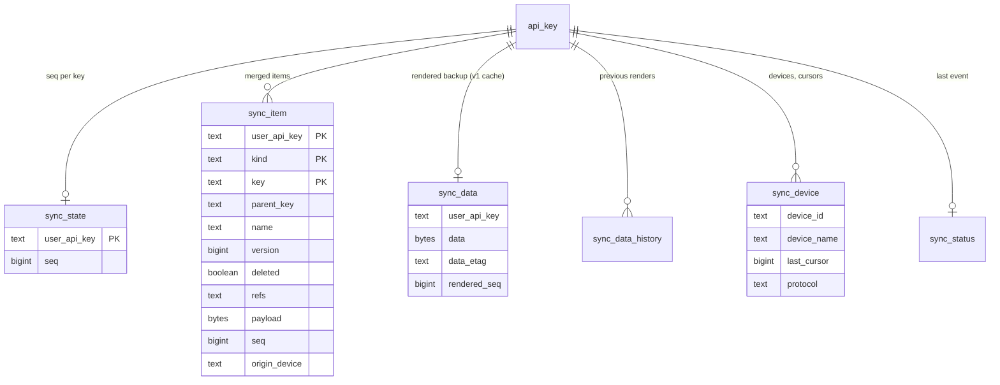

# Data model

## sync_item

One row per merged item. `kind` is one of `manga`, `chapter`, `category`, `source`,
`app_pref`, `source_pref`, `ext_store`, `saved_search`, `extra`.

| Column | Meaning |
|---|---|
| `key` | `source\|url` for manga, `<manga key>\x1f<url>` for chapters, `uid:<uid>` / `name:<name>` for categories, natural keys for settings |
| `parent_key` | manga key for chapters, source key for source preferences |
| `name` | category name (used for the uid-less fallback match) |
| `version` | the client's counter; higher wins |
| `deleted` | category tombstone |
| `refs` | manga → category keys, `\x1f`-separated |
| `payload` | the item's protobuf message (a manga payload carries neither chapters nor category numbers) |
| `seq` | the key's `sync_state.seq` at the last change of this row |
| `origin_device` | device that made the last change (`legacy`, `migration`, `restore` for server-side writes) |
| `modified_at` | the payload's `last_modified_at`, the tiebreaker for equal-version conflicts |

The server never parses the payload beyond what the merge keys need, which is what will let
end-to-end encryption reuse the same store.

## seq and cursors

`sync_state.seq` increases by one for every request that writes something. All rows touched
by that request carry the new `seq`. A client's cursor is the `seq` it last saw; the delta it
receives is `seq > cursor` (plus all categories). `sync_device.last_cursor` records it per
device for the web UI.

## Raw blob, render cache and history

`sync_data` carries two payloads per key. `raw_data`/`raw_etag`/`raw_seq` hold the last v1
client upload byte-for-byte: while `raw_seq` still equals `sync_state.seq` (no other device
has written since), a v1 `GET` echoes exactly those bytes under their `uuid=` etag, so v1
fleets keep the pre-1.3 semantics where the client-side merge is authoritative.
`raw_pending` marks an upload that has not been merged into `sync_item` yet: a v1 `PUT`
only stores the bytes and answers, and the import runs about 20 s later in the background
or on the first v2 merge, snapshot or render that needs the store, whichever comes first.
Every path that advances `sync_state.seq` imports first, so a stale raw blob is always an
imported one.
`data`/`data_etag`/`rendered_seq` hold the last full backup rendered from the item store; it
serves the v2 snapshot endpoint, and v1 clients only when the raw blob is stale. Renders
refresh lazily on the first read after a change.

Both v1 uploads and render refreshes land in `sync_data_history` (`syncHistoryLimit`
entries): `uuid=` entries are device uploads, `seq=` entries are server renders. *Restore*
in the web UI rebuilds the item store from an entry and installs its bytes as the raw blob,
so v1 devices receive it verbatim.

A `sync_data` row with `rendered_seq = NULL` and no raw blob is a payload written by a
pre-1.3 server. On the first request for that key after the upgrade it is promoted to the
raw blob (keeping its original `uuid=` etag) with `raw_pending` set and imported into
`sync_item` like any other upload; if it cannot be decoded it keeps being served to v1
clients verbatim, is never overwritten by renders, and the item store starts empty.
