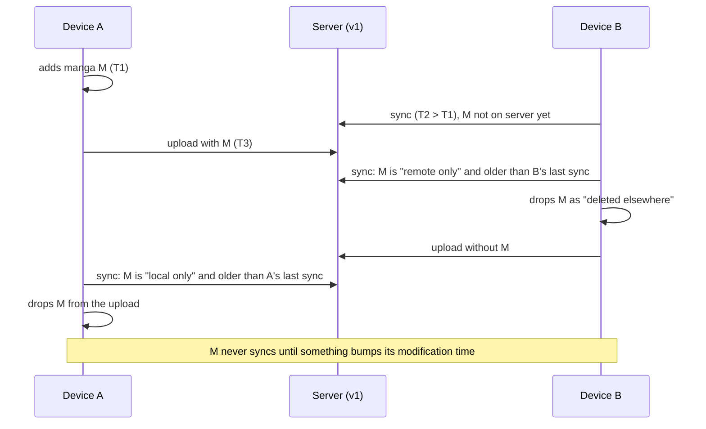
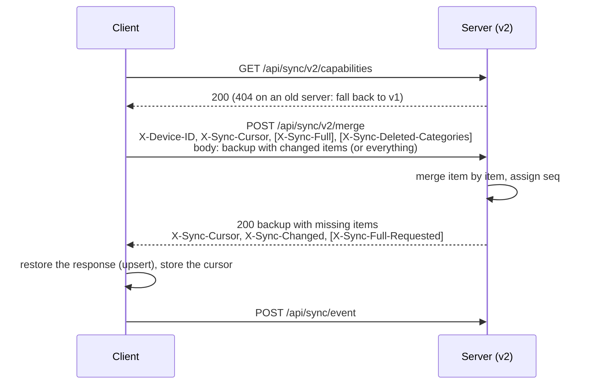
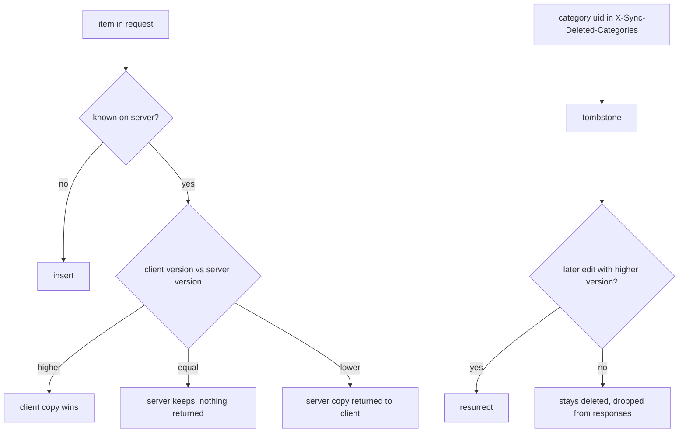

# Sync protocol v2

Protocol v2 moves the merge to the server. Clients no longer download, merge and re-upload
the whole library; they send what changed and receive what they lack. Protocol v1
(`GET`/`PUT /api/sync/content`) keeps working on top of the same data and is deprecated.

## Why

With v1 every client decided on its own that an item missing from the other side had been
deleted, by comparing the item's modification time with the client's own last-sync time.
That inference breaks with two or more devices:

Only the server knows when an item first arrived. In v2 absence never means deletion; the
only deletions are explicit tombstones.

## Round trip

## Request

| Header | Meaning |
|---|---|
| `X-Device-ID` (required) | stable identifier of the device |
| `X-Device-Name` | shown in the web UI |
| `X-Sync-Cursor` | cursor from the previous response; 0 or absent on the first sync |
| `X-Sync-Full` | `true` when the body holds the complete library |
| `X-Sync-Deleted-Categories` | comma-separated category uids deleted on the client since the last sync |
| `Content-Encoding: gzip` | optional |

Body: a Tachiyomi backup (protobuf), the same bytes the client already produces for v1.
For a delta the client includes only manga changed since its last successful upload (with
only their changed chapters), **all** categories (the server needs them to map category
numbers), and settings only when they changed. A manga without chapters in the body means
"nothing to say about chapters", never "no chapters".

## Response

Body: a backup with everything the client is missing:

- all live categories (so the client can map category numbers and delete categories that
  vanished),
- manga/chapters/settings changed since the cursor by other devices, and any item where the
  server copy won over the client's,
- with `X-Sync-Cursor: 0` or `X-Sync-Full: true`: the complete library.

| Header | Meaning |
|---|---|
| `X-Sync-Cursor` | send it back next time |
| `X-Sync-Changed` | `false` when the body carries nothing new; the client can skip the restore |
| `X-Sync-Full-Requested` | `true` when the server wants a full library next time (after an import or a server-side restore) |
| `ETag` | `seq=<cursor>`, the same value v1 clients see |

Clients apply the response with their normal restore (upsert). Deleted categories are
detected by their absence from the response's category list, which is complete.

## Merge rules

- Manga are keyed by `source|url`, chapters by their url within the manga, categories by
  `uid` (falling back to name for uid-less categories). Category membership is stored as
  references to categories, so it survives different category orders on different devices.
- `version` is only ever set by the clients (their SQL triggers bump it on meaningful
  changes); the server stores the winning copy and never bumps it.
- Un-favouriting is a normal versioned change (`favorite=false` inside the manga), not a
  deletion. Chapters are never deleted by sync.
- Settings (sources, preferences, source preferences, extension repos, saved searches) have
  no version: the client copy wins.
- Every write gets the key's next `seq`; the cursor is the current `seq`. "Changed since
  cursor" is a single indexed query.

## Idempotency and concurrency

- Retrying a request is safe: identical items produce no writes and the cursor does not move.
- Merges for one API key run one at a time (in-process lock plus a row lock on Postgres).
- A cursor ahead of the server's (database restored from an older backup) is treated as 0
  and `X-Sync-Full-Requested` is returned.

## Protocol v1 on a v2 server

`GET /api/sync/content` serves the library rendered from the item store (cached until the
next change); `PUT` merges the uploaded backup like a full v2 request from a device called
`legacy`. `If-Match`/`If-None-Match` keep working with the new `seq=` ETags.

Consequences for v1 clients:

- Items a v1 client dropped through its absence rule come back from the server. This is the
  correct outcome for the bug above.
- Category deletions made on a v1 client do not propagate (there is no tombstone); deleting
  the category on a v2 client does.
- Every v1 response carries `Deprecation: true`; the web UI marks such devices as *legacy*.
